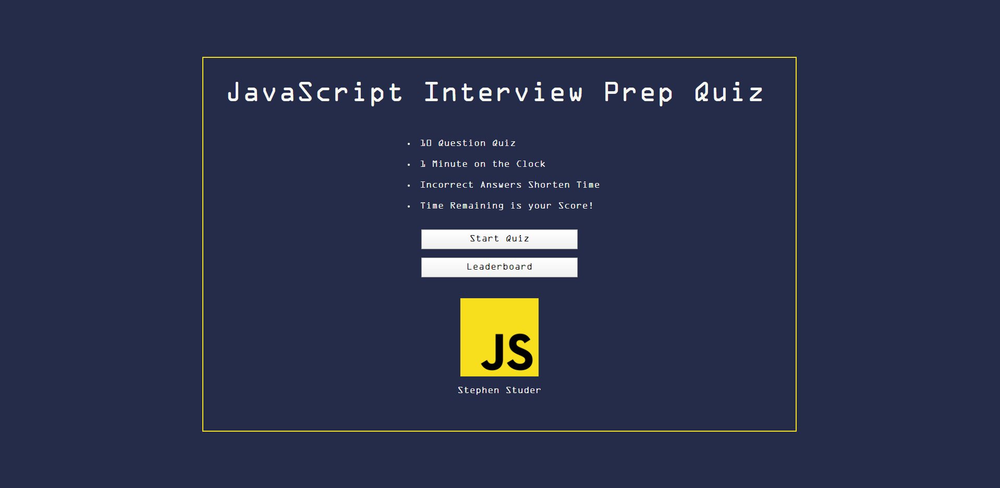

# javascript-interview-quiz
This is a 10 question quiz to help prepare for JavaScript job interviews.

## deployed website
http://stephenstuder.com/javascript-interview-prep-quiz/

## screenshot

## how it works
Plain old vanilla JavaScript. 

## future improvements
I could add a database and make the code dynamic so that it could run multiple quizzes. Also, I could sort the local storage before adding it to the leaderboard. 